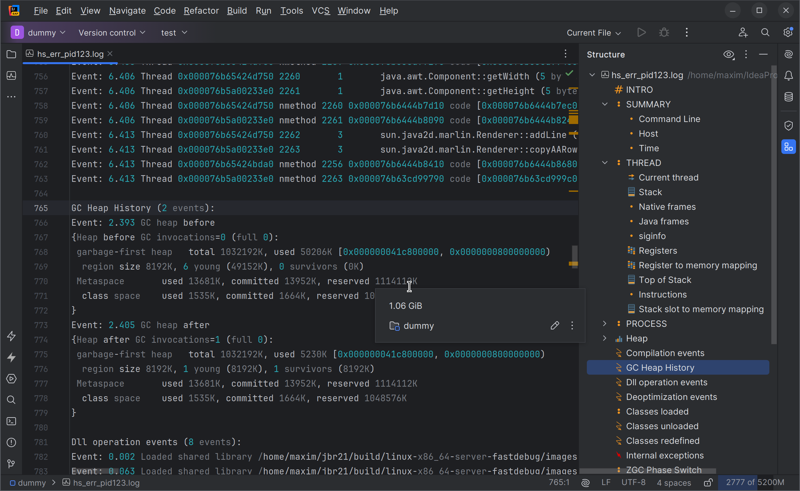

HotSpot Crash Examiner
===

[![Official JetBrains Project][jb-official-svg]][jb-official]
[![Contributions welcome][contributions-welcome-svg]][contributions-welcome]

<!-- TOC -->
* [HotSpot Crash Examiner](#hotspot-crash-examiner)
  * [Overview](#overview)
    * [Toolwindow](#toolwindow)
    * [Address Hints](#address-hints)
    * [Find Address](#find-address)
    * [Hints](#hints)
    * [Go To Declaration](#go-to-declaration)
    * [Configuration Options](#configuration-options)
  * [Installation](#installation)
  * [Resources](#resources)
<!-- TOC -->

<!-- Plugin description -->
Provides IDE capabilities
to examining [HotSpot JVM fatal error logs](https://docs.oracle.com/javase/10/troubleshoot/fatal-error-log.htm):
* Syntax highlighting
* Structured view
* Folding
* Go to declaration for Java names
* A dedicated tool window
* Documentation hints for addresses, keywords, sizes, etc.

Additional features:
* Configurable auto-folding of sections (`Settings | Other Settings | HotSpot Crash Examiner`).
* The tool window lists important properties from the log, their explanation,
  and detailed analysis.
* Highlights the relevant portion of the log when clicking on a tool window element.
* Mark the properties that require attention such as low physical memory on the JVM host.
  Limits are configurable in the Settings dialog.
* Go to declaration for Java classes and methods.
* `Find Address` action from the editor's context menu will highlight all occurrences of the currently selected address
  and those near it (configurable in the Settings dialog).
  If the address belongs to some thread's stack or can be found in the memory map, that will also be highlighted.
* Documentation hints for register names, signals, and other keywords; detailed info about addresses.

Automatically recognizes the files matching these patterns: `hs_err_*.log`, `java_error_in_*.log`, and `crash*.txt`.

To view any file with this plugin, select the file in the project view, choose
`Override File Type` and then `HotSpot Fatal Error Log`
<!-- Plugin description end -->

## Overview

### Toolwindow
Configurable warnings in the tool window draw attention to unusual features of the crash:

A human-readable analysis of the crash:

### Address Hints
Hold the mouse pointer over an address to try to resolve it.
Works for thread, stack, Java heap, dynamic libraries, and other addresses:

### Find Address
Pick the `Find Address` option from the context menu 
to highlight the address under the cursor and addresses near it everywhere in the log file:

Addresses do not have to match textually or even appear in the log.
For example, address pointing into a memory-mapped region will highlight that
region in the log.

### Hints
Numbers that denote the size are converted into a more human-readable form: 

Signals, registers, and common thread names, some JVM terms also have
documentation hints.

### Go To Declaration
Go to declaration for Java symbols and classes;
requires Java support in the IDE and the corresponding project with the classes opened:

### Configuration Options
Various thresholds are configurable in the plugin's Settings dialog:

## Installation

- Using the IDE built-in plugin system:
  
  <kbd>Settings/Preferences</kbd> > <kbd>Plugins</kbd> > <kbd>Marketplace</kbd> > <kbd>Search for "HotSpot Crash Examiner"</kbd> >
  <kbd>Install</kbd>
  
- Manually:

  Download the [latest release](https://github.com/JetBrains/HotSpotCrashExaminerPlugin/releases/latest) and install it manually using
  <kbd>Settings/Preferences</kbd> > <kbd>Plugins</kbd> > <kbd>⚙️</kbd> > <kbd>Install plugin from disk...</kbd>

## Resources

* [Java Platform, Standard Edition Troubleshooting Guide. A Fatal Error Log](https://docs.oracle.com/javase/10/troubleshoot/fatal-error-log.htm)
* [YouTube — Volker Simonis — Analyzing HotSpot Crashes](https://www.youtube.com/watch?v=buPX_nj40Tg&t=3078s)
* [YouTube — JVM Crash Dump Analysis](https://www.youtube.com/watch?v=jd6dJa7tSNU)

<!-- Badges -->
[jb-official]: https://github.com/JetBrains#jetbrains-on-github
[jb-official-svg]: https://jb.gg/badges/official.svg

[plugin-repo]: https://github.com/JetBrains/HotSpotCrashExaminerPlugin

[contributions-welcome-svg]: http://img.shields.io/badge/contributions-welcome-brightgreen
[contributions-welcome]: https://github.com/JetBrains/HotSpotCrashExaminerPlugin/blob/master/CONTRIBUTING.md
